# Introduction to the embedded Cortex M3 MCU of the GW1NSR-4C

Gowin parts target the low-mid range in terms of LUT count, their products are further bolstered by having dedicated hard-core peripherals such as extra DRAM and ADCs, the most notable of which are the microcontroller IPs which can be coupled with custom FPGA peripherals to perform specific tasks very efficiently. In this tutorial we explore the ARM Cortex M3 microcontroller IP integrated in the GW1NSR-4C chip that powers the Sipeed Tang Nano 4K using the official Gowin toolchain on Windows.

Utilizing the embedded microcontroller requires first instantiating it in an FPGA design along with clocking resources and any peripherals you may need, then actually writing the firmware code to make it do stuff.

## **Configuring the FPGA for the EMPU:**

This is primarily done through the IP generator wizard of the Gowin EDA, I'm currently using Gowin Education Ver. 1.9.8.03 of the IDE.

* Create a new FPGA design project, making sure to select the correct chip.

* Create a new HDL file where you will perform the top-level instantiation of all the IP we need, it can be in either Verilog or VHDL. For this tutorial we'll need the following ports:
    * A clock input to take in the onboard 27MHz crystal oscillator.
    * A push-button input to act as the reset for our microcontroller.
    * Some GPIOs to light up LEDs and connect a 1602 character LCD, I'm using 8 GPIO bits declared as "inout".
    * UART TX pin, I only show an example of transmitting from the microcontroller to my computer, but you can also experiment with UART RX if you wish.

My VHDL entity declaration looks like this:

	entity soc_top is
		port(
			xtal_clk, reset_n: in std_logic;
			gpio: inout std_logic_vector(7 downto 0);
			UART_TX: out std_logic
		);
	end soc_top;

### **Instantiating the EMPU**

* Open the IP Core Generator and look for the "Gowin_EMPU(GW1NS-4C)" core, double click the IP to start configuring it.

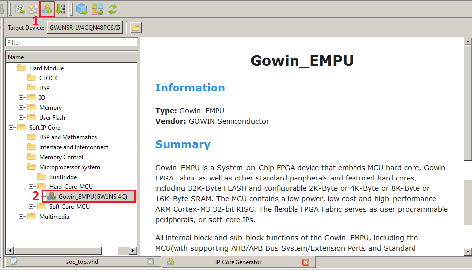

You may have noticed that this core is listed under "Soft IP", the reason is that while the bulk of the microcontroller (mainly the CPU) is built-in silicon, the microcontroller still requires FPGA resources for RAM, flash and other peripherals. Enabling more peripherals leads to increased resource utilization. Make sure the core is listed under "Hard-Core-MCU" nonetheless as Gowin does provide an entirely soft-core Cortex-M solution for their bigger FPGAs such as the GW2A series.

You might also wonder what's up with the GW1NS-4C moniker. The GW1NSR-4C of the Nano 4K is a close cousin of the GW1NS-4C, the only difference is that the "R" variant includes extra PSRAM/HyperRAM in the package.

* The next step is to configure the peripherals of the EMPU to suit your needs using the IP generator pop-up, when a peripheral is enabled the label turns green with the exception of SRAM which is always enabled.

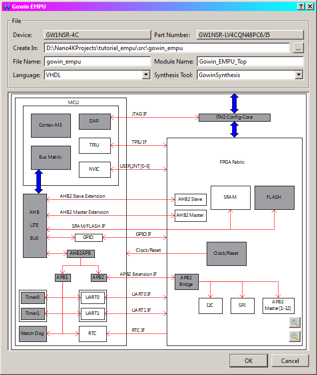
 
  * Configure SRAM to 8KB (remember, SRAM for the MCU is taken from the FPGA's BSRAM). 
  * Enable the GPIO peripheral and make sure the GPIO I/O option is ticked. 

When the GPIO I/O option is ticked the GPIOs are combined into a single 16-bit bi-directional bus of type inout (tri-state based). But when it is unchecked the GPIOs are split into two buses, one for input and one for output (with an accompanying gpioouten bus to indicate whether a particular GPIO line is in input mode or output mode). There is still only 16 total GPIO lines, each can be either input or output, but this separation helps design internal FPGA peripherals where the inout type cannot be synthesized as FPGAs lack internal tri-state buffers.

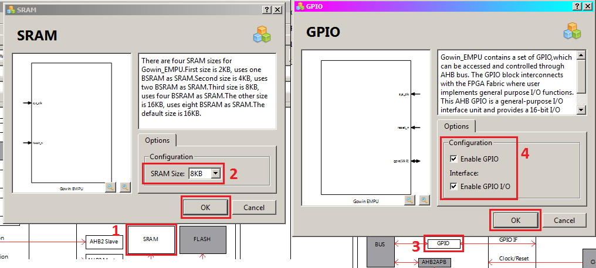

  * Enable UART0, then change the language option at the top to match the language you're using, in my case I'm using VHDL.
  * Click OK to generate, then OK again to add the newly generated files to your project.

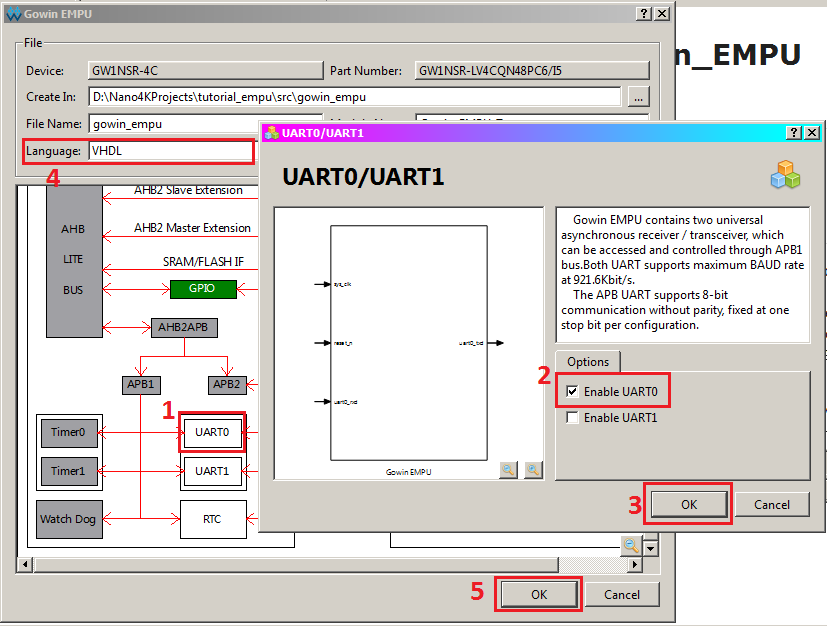

  * Among the generated files is a temporary file ("gowin_empu_tmp.vhd") with an example instantiation. Copy it and paste it to our top-level design file, then connect each of the MCU's signals to the appropriate top-level ports. 

For VHDL this looks something like this:

	architecture structural of soc_top is
		begin
			cortexM3_inst: entity work.Gowin_EMPU_Top
			port map (
				sys_clk => xtal_clk, -- direct connection to 27MHz crystal oscillator
				gpio(7 downto 0) => gpio, --gpio(15 downto 8) unused for now
				uart0_rxd => '1', --RX unused for now
				uart0_txd => UART_TX,
				reset_n => reset_n --reset button
			);
	end structural;

(VHDL tip: entity work.entity_name is a lifesaver, but you can also use the component-based instantiation if you really want to, Gowin IDE automatically adds all VHDL files to the "work" library)

### **Instantiating the PLL**

You can increase the MCU's clock up to 80MHz with the use of a PLL or phase-locked loop. It is an analog component that can multiply and divide frequency to generate an output clock that is a rational multiple of the input clock's frequency. 

* Optionally, we can use Gowin's IP generator to configure and utilize a PLL to double the crystal clock's frequency. In the IP Core Generator tab search for the PLLVR module and double click to bring up its IP configurator pop-up.
  * Making sure the IP configurator is in the "General mode", change the CLKIN value to 27 and the Expected Frequency value of CLKOUT to 54 (all frequencies are in MHz). Click the Calculate button to set the configuration, it automatically calculates the required division factors and warns you if a frequency target cannot be met. Finally make sure the IP generator is set to your HDL of choice and click OK to generate and add the files to your project.

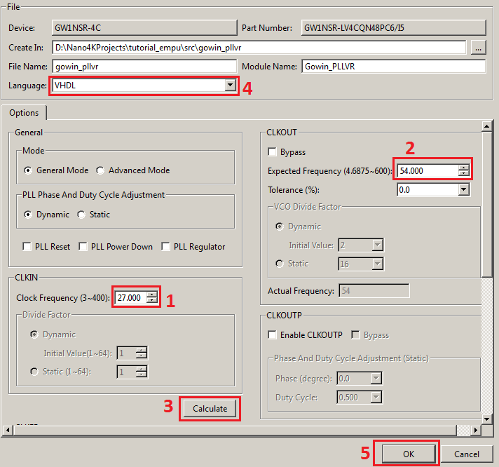

  * Much like the MCU instantiation, a temporary file containing an example instance of the PLL will be opened up. Copy and paste it to the top-level module file we created, then modify the previous MCU instantiation accordingly so that it will use the PLL's clock output instead of the crystal clock, don't forget to also modify the PLL's instantiation so that it takes in the crystal clock as the input reference.

In VHDL, I needed to add a signal (wire) between the PLL and MCU for the doubled clock:

	architecture structural of soc_top is
		signal clk_doubler_out: std_logic;
		begin
			cortexM3_inst: entity work.Gowin_EMPU_Top
			port map (
				sys_clk => clk_doubler_out, -- now using a 54MHz clock from the PLL
				gpio(7 downto 0) => gpio, --gpio(15 downto 8) unused for now
				uart0_rxd => '1', --RX unused for now
				uart0_txd => UART_TX,
				reset_n => reset_n --reset button
			);

			pllvr_inst: entity work.Gowin_PLLVR
			port map (
				clkout => clk_doubler_out, --2x xtal_clk
				clkin => xtal_clk --reference input clock is the crystal oscillator
			);
	end structural;

This is a good time to mention Gowin IDE's .ipc files, when you generate an IP core the settings you used are saved in an .ipc file inside the subfolder where the encrypted IP files are stored (you may have to check in a file explorer). If you want to make minor adjustments to an existing IP core without completely redoing your setup, you can simply open the .ipc file in the IP Core Generator using the folder icon and modify the existing modification, make sure to regenerate after you're done.

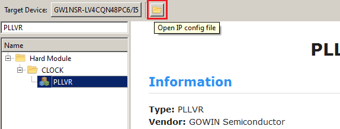

If you find yourself having to calculate the PLLVR division factors yourself or otherwise don't use Gowin's IDE, [this PLL Calculator comes in handy.](https://github.com/juj/gowin_fpga_code_generators)

The PLLVR offers additional output channels for dividing/phase-shifting the main output so that you won't need extra PLLs or clock dividers, you can read more about [the clocking resources of Gowin FPGAs in UG286E.](http://cdn.gowinsemi.com.cn/UG286E.pdf)

### **Setting up the ports**

This is the VHDL top module I ended up with:

	--"soc_top.vhd"
	LIBRARY ieee;
	USE ieee.std_logic_1164.all;

	entity soc_top is
		port(
			xtal_clk, reset_n: in std_logic;
			gpio: inout std_logic_vector(7 downto 0);
			UART_TX: out std_logic
		);
	end soc_top;

	architecture structural of soc_top is
		signal clk_doubler_out: std_logic;
		begin
			cortexM3_inst: entity work.Gowin_EMPU_Top
			port map (
				sys_clk => clk_doubler_out, -- now using a 54MHz clock from the PLL
				gpio(7 downto 0) => gpio, --gpio(15 downto 8) unused for now
				uart0_rxd => '1', --RX unused for now
				uart0_txd => UART_TX,
				reset_n => reset_n --reset button
			);

			pllvr_inst: entity work.Gowin_PLLVR
			port map (
				clkout => clk_doubler_out, --2x xtal_clk
				clkin => xtal_clk --reference input clock is the crystal oscillator
			);
	end structural;

* Run synthesis to make sure everything compiles correctly, you're now ready to set up the ports using the FloorPlanner.
* Open the FloorPlanner and create a new .cst file, use the FloorPlanner to set the following constraints:
 * Crystal clock signal to pin 45 (27MHz crystal oscillator on the Tang Nano 4K).
 * UART TX signal to pin 19, set Open Drain mode to ON.
 * Reset button signal to pin 15 (USR_KEY_2 on the Tang Nano 4K).
 * GPIO pins 7 through 0 to pins 35, 34, 32, 31, 27, 28, 29 and 30 respectively, and set the IO type to LVCMOS25 for all of them.

This is the .cst file I ended up with:

	//Copyright (C)2014-2022 Gowin Semiconductor Corporation.
	//All rights reserved. 
	//File Title: Physical Constraints file
	//GOWIN Version: 1.9.8.03 Education
	//Part Number: GW1NSR-LV4CQN48PC6/I5
	//Device: GW1NSR-4C
	//Created Time: Wed 09 14 16:32:04 2022

	IO_LOC "gpio[7]" 35;
	IO_PORT "gpio[7]" IO_TYPE=LVCMOS25 PULL_MODE=UP DRIVE=8;
	IO_LOC "gpio[6]" 34;
	IO_PORT "gpio[6]" IO_TYPE=LVCMOS25 PULL_MODE=UP DRIVE=8;
	IO_LOC "gpio[5]" 32;
	IO_PORT "gpio[5]" IO_TYPE=LVCMOS25 PULL_MODE=UP DRIVE=8;
	IO_LOC "gpio[4]" 31;
	IO_PORT "gpio[4]" IO_TYPE=LVCMOS25 PULL_MODE=UP DRIVE=8;
	IO_LOC "gpio[3]" 27;
	IO_PORT "gpio[3]" IO_TYPE=LVCMOS25 PULL_MODE=UP DRIVE=8;
	IO_LOC "gpio[2]" 28;
	IO_PORT "gpio[2]" IO_TYPE=LVCMOS25 PULL_MODE=UP DRIVE=8;
	IO_LOC "gpio[1]" 29;
	IO_PORT "gpio[1]" IO_TYPE=LVCMOS25 PULL_MODE=UP DRIVE=8;
	IO_LOC "gpio[0]" 30;
	IO_PORT "gpio[0]" IO_TYPE=LVCMOS25 PULL_MODE=UP DRIVE=8;
	IO_LOC "UART_TX" 19;
	IO_PORT "UART_TX" PULL_MODE=NONE DRIVE=8 OPEN_DRAIN=ON;
	IO_LOC "reset_n" 15;
	IO_PORT "reset_n" PULL_MODE=UP;
	IO_LOC "xtal_clk" 45;
	IO_PORT "xtal_clk" PULL_MODE=UP;

 * Run place & route and make sure there's no errors, we now have an FPGA bitstream ready to deploy the Cortex M3 MCU. Now we need to write the C firmware using GMD.

## **Installing the GMD:**

The Cortex M3 microcontroller can be programmed in C/C++ using either Keil MDK or Gowin's MCU Designer based on Eclipse CDT, [the Education version of the GMD can be downloaded from here](https://magicjellybeanfpga.github.io/mjb/software.html) and that's what we'll use in this tutorial.

Installation is straightforward, unzip the package and start the wizard. The wizard doesn't allow you to change the installation directory so make sure to have some space on the C:\ drive, the GMD is also configured to use "C:\GMD\workspace" as the workspace directory by default, and the workspace also includes various example projects for Gowin's microcontroller IPs, both soft core and silicon. At the end of the installation you'll get the option to install drivers for the SEGGER J-Link JTAG debugger, if you have one of those laying around and want to use it leave the option ticked.

You will also need to download Gowin's SDK kit for the GW1NS(R)-4C, [the latest version as of writing is V1.1.3 and can be downloaded from this hotlink](https://cdn.gowinsemi.com.cn/Gowin_EMPU(GW1NS-4C)_V1.1.3.zip). It contains the Cortex M3 configuration files for both the GMD and ARM Keil, the libraries you need to interact with the peripherals and several reference designs showcasing the variety of the EMPU's features.

## **Setting up a new GMD Eclipse project:**

* Extract the contents of the SDK archive, then open the GMD.
* Go to File -> New -> C Project. Give a name to your project and select a project type of "Executable -> Empty Project" with the "ARM Cross GCC" toolchain.

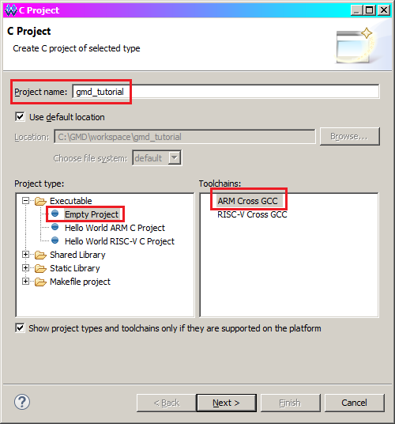

* Click Next, keep the defaults for the build configurations and click Next again. Finally select the toolchain "GNU MCU Eclipse ARM Embedded GCC (arm-none-eabi-gcc)" if it's not selected already and click Finish to close the wizard.
* From the extracted SDK archive contents, navigate to the subfolder "src\c_lib", copy both the "template" and "lib" folders in your new project's folder. If you stuck to Eclipse's workspace defaults then the folder is "C:\GMD\workspace\project_title", paste the files there.
* The "lib" folder contains device configurations intended for both GMD and Keil, you need to delete the Keil version of the files to avoid conflicts. Do this by deleting the "lib\CMSIS\CoreSupport\arm" and "lib\CMSIS\DeviceSupport\startup\arm" directories.
* Go back to GMD and hit F5 to refresh your project's files if they haven't already. You should see the following file structure:

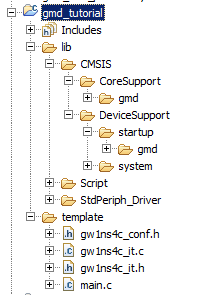

* Right click on your project in the Project Explorer tab and open Properties. Head to "C/C++ Build -> Settings" and open the Tool Settings tab (if the tab isn't showing you may need to use the cursors on the right until it shows up).
* In the Tool Settings tab, set the Target Processor configurations to: (if it isn't set already)
  * Arm family：cortex-m3
  * Architecture：Toolchain default
  * Instruction set：Thumb (-mthumb)
  * Endianness：Toolchain default
  * Unaligned access：Toolchain default
* Find the "GNU ARM Cross Assembler -> Preprocessor" settings and create a new element in the "Defined symbols" pane, give this symbol a value of "__STARTUP_CLEAR_BSS".

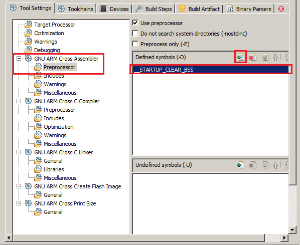

* Head to "GNU ARM Cross C Compiler -> Includes" and add the following directories (use the Workspace... option instead of creating hard links):
    * lib/CMSIS/CoreSupport/gmd
    * lib/CMSIS/DeviceSupport/system
    * lib/StdPeriph_Driver/Includes
    * template

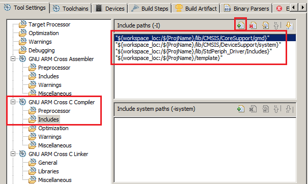

* Go to "GNU ARM Cross C Linker -> General" and add the "lib/Script/flash/gmd/gw1ns4c_flash.ld" linker script file.
* Finally in "GNU ARM Cross Create Flash Image -> General", change the "Output file format" setting to "Raw binary".
* Go to the "Devices" tab and select the "ARM -> ARM Cortex M3 -> ARMCM3" device, click Apply then OK to save your settings.

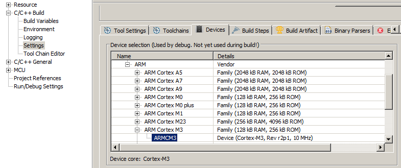

### **The library structure:**

The Gowin EMPU implements ARM's CMSIS-Core abstraction interface similarly to other parts like the STM32 microcontrollers. The CMSIS defines standard functions that can be used to access the Cortex-M3's system control registers, SysTick timer and other functionality common in Cortex-M devices. The generic CMSIS-Core files are contained in the "lib\CMSIS\CoreSupport\gmd" subfolder.

Gowin provides a bootloader (lib\CMSIS\DeviceSupport\startup\gmd\startup_gw1ns4c.S) that initializes the stack pointer and program counter, and also defines the interrupt vector table for various system, peripheral and reset interrupts. The behavior of interrupt handlers is provided by the user by implementing the interrupt service routine functions defined in "template\gw1ns4c_it.c", or by just implementing the defined interrupt handler as a C function with the same name.

Gowin also provides a CMSIS Peripheral Access Layer System in the "CMSIS\system\" directory, it is comprised of primarily two files:
  - The "gw1ns4c.h" header file which defines the register structs of the various peripherals and the memory addresses at which the peripherals can be found. Gowin suggests that the user only imports this specific header in their "main.c" file.
  - The "system_gw1ns4c.c" file which is primarily used for clock configuration, it defines global system/peripheral clock variables, and functions for initializing and updating them. The SystemCoreClock variable in particular is part of CMSIS-Core and various peripherals may rely on its value for their operation so it's important that it matches the real-life clocking situation (the clock signal at the EMPU's clock pin). SystemCoreClockUpdate() simply copies the predefined __SYSTEM_CLOCK macro by default, but it can be modified to update SystemCoreClock in order to match frequency changes from the PLL (PLLVR can change output clock division dynamically to obtain a slower clock for power-saving purposes).

Finally, GMD requires a linker script that defines the size of available SRAM and flash, and the placement of various code sections. A sample linker script is provided by Gowin as "Script/flash/gmd/gw1ns4c_flash.ld".

### **Clock and SRAM configuration**

* Before writing any C code, we should configure our clock and SRAM settings:
	- To modify the clock value that our MCU expects, open the "lib/CMSIS/DeviceSupport/system/system_gw1ns4c.c" file and look for the macro definition of "__SYSTEM_CLOCK", modify its value to match the clock speed of our design in Hz. If you used the PLL as shown earlier the value would be 54000000UL (unsigned long), you can ignore the "__XTAL" definition. This setting affects certain functionality such as baudrate generation for the UART peripheral so make sure it matches your setup:

		```#define __SYSTEM_CLOCK    (54000000UL)	   /* 54MHz */```
	- To change the SRAM setting, open the "lib\Script\flash\gmd\gw1ns4c_flash.ld" linker configs file and modify the "RAM" line of the "MEMORY" section to match the SRAM size you assigned to Gowin EMPU, in our case this is 8KiB so we'll put 8192 bytes in the LENGTH field (you can also use 0x2000 in hex):
		```
		MEMORY
		{
			FLASH (rx) : ORIGIN = 0x0,        LENGTH = 0x8000  /* 32KByte */
			RAM (rwx)  : ORIGIN = 0x20000000, LENGTH = 8192  /* 8KByte */
		}

### **LED blinky example with timer delays**

* In this simple LED blinker, I show how a GPIO should be instantiated before it is used and a basic "delay milliseconds" function using Timer0 of the EMPU: (copy and replace the contents of "main.c" in the template folder)
	```
	/* Includes ------------------------------------------------------------------*/
	#include "gw1ns4c.h"
	/*----------------------------------------------------------------------------*/

	/* Declarations*/
	void initializeGPIO();
	void initializeTimer();
	void delayMillis(uint32_t ms);

	int main(void)
	{
		SystemInit(); //Configures CPU for the defined system clock
		initializeGPIO();
		initializeTimer();

		//make GPIO pin7 an output pin without relying on the library
		//GPIO0 -> OUTENSET |= GPIO_Pin_7;

		/* Infinite loop */
		while(1)
		{
			GPIO_ResetBit(GPIO0, GPIO_Pin_7);
			delayMillis(500);
			GPIO_SetBit(GPIO0, GPIO_Pin_7);
			delayMillis(500);
		}
	}

	void initializeGPIO() {
		GPIO_InitTypeDef gpioInitStruct;

		//Select pin7, you can OR pins together to initialize them at the same time
		gpioInitStruct.GPIO_Pin = GPIO_Pin_7;

		//Set selected pins as output (see GPIOMode_TypeDef in gw1ns4c_gpio.h)
		gpioInitStruct.GPIO_Mode = GPIO_Mode_OUT;

		//Disable interrupts on selected pins (see GPIOInt_TypeDef)
		gpioInitStruct.GPIO_Int = GPIO_Int_Disable;

		//Initialize the GPIO using the configured init struct
		//GPIO0 is a pointer containing the memory address of the GPIO APB peripheral
		GPIO_Init(GPIO0, &gpioInitStruct);
	}

	void initializeTimer() {
		TIMER_InitTypeDef timerInitStruct;

		timerInitStruct.Reload = 0;

		//Disable interrupt requests from timer for now
		timerInitStruct.TIMER_Int = DISABLE;

		//Disable timer enabling/clocking from external pins (GPIO)
		timerInitStruct.TIMER_Exti = TIMER_DISABLE;

		TIMER_Init(TIMER0, &timerInitStruct);
		TIMER_StopTimer(TIMER0);
	}

	#define CYCLES_PER_MILLISEC (SystemCoreClock / 1000)
	void delayMillis(uint32_t ms) {
		TIMER_StopTimer(TIMER0);
		//Reset timer just in case it was modified elsewhere
		TIMER_SetValue(TIMER0, 0); 
		TIMER_EnableIRQ(TIMER0);

		uint32_t reloadVal = CYCLES_PER_MILLISEC * ms;
		//Timer interrupt will trigger when it reaches the reload value
		TIMER_SetReload(TIMER0, reloadVal); 

		TIMER_StartTimer(TIMER0);
		//Block execution until timer wastes the calculated amount of cycles
		while (TIMER_GetIRQStatus(TIMER0) != SET);

		TIMER_StopTimer(TIMER0);
		TIMER_ClearIRQ(TIMER0);
		TIMER_SetValue(TIMER0, 0);
	}
	```

* Connect an LED to pin 35 of the Nano 4K (which corresponds to GPIO7 of our MCU).
* Build the GMD project using the Eclipse hammer icon, or through "Project -> Build Project".
* Run PnR on the FPGA project if you haven't already, connect your Tang Nano 4K then open the Programmer (Sipeed's own modified Programmer, the V1.9.8.03 Education Programmer or openFPGALoader will work).
* In the Programmer Device Configuration, set the Access Mode to "MCU Mode" and the Operation to "Firmware Erase, Program".
* Under "Programming Options" set the .fs bitstream file to the "impl/pnr/project_name.fs" file of your FPGA project if it isn't set already, and set the Firmware/Binary File to the "Debug/project_name.bin" file of your GMD project.
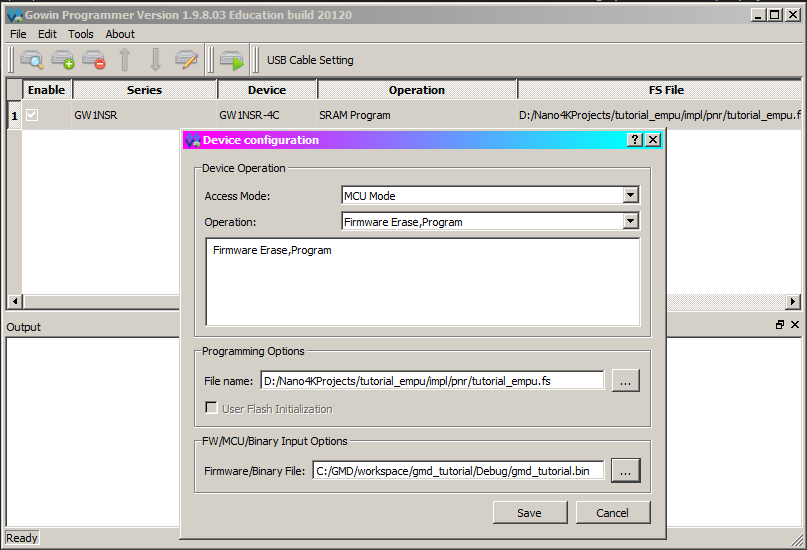
* Flash your board, you should see the LED you added blinking!
* You can also check out the assembly listing that was generated by the GCC by heading to the GMD project's properties -> C/C++ Build -> Settings -> Miscellaneous and ticking the "Generate assembler listing" flag.
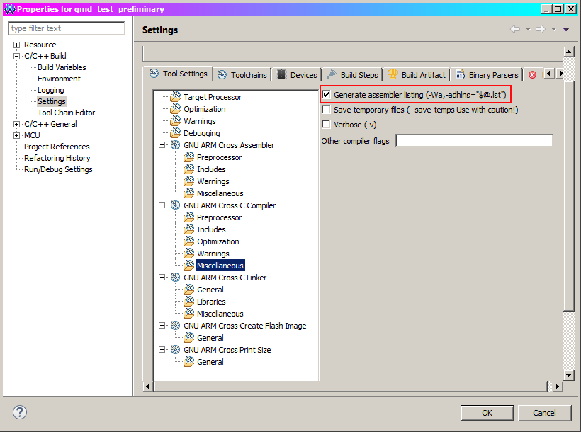

Each C file gets a listing inside the same directory, for example the "main.c" assembly is saved in "main.o.lst".

### **Redirecting printf() to UART**
### **1602 Character LCD library**


## **Conclusion**:

Relevant Gowin documentation:

* [Gowin_EMPU IDE user guide (IPUG928E)](http://cdn.gowinsemi.com.cn/IPUG928E.pdf) for more information on the usage of J-Link debuggers, Keil MDK and more.
* [Gowin_EMPU Software Design(IPUG931E)](http://cdn.gowinsemi.com.cn/IPUG931E.pdf) for the EMPU's memory map, peripheral register definition and more.
* [Gowin_EMPU Hardware Design(IPUG932E)](http://cdn.gowinsemi.com.cn/IPUG932E.pdf) for signal definition, peripheral details and more.
* [The latest version of GW1NS-4C example projects and libraries from Gowin](https://cdn.gowinsemi.com.cn/Gowin_EMPU(GW1NS-4C)_V1.1.3.zip). Make sure to alter SRAM and clock configurations to match your FPGA design setup.